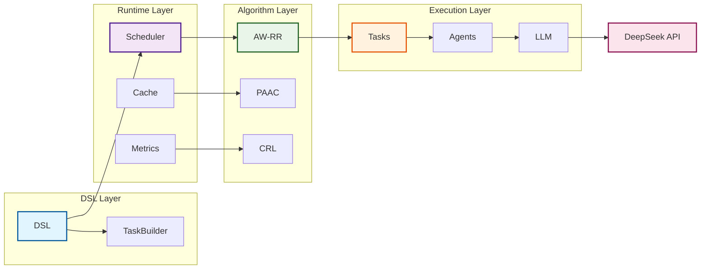
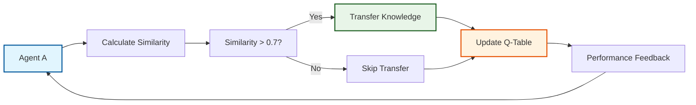
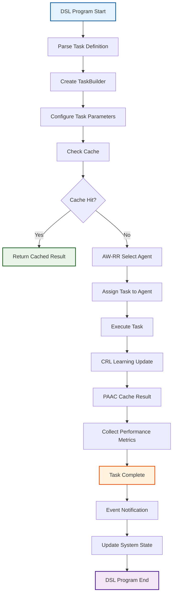
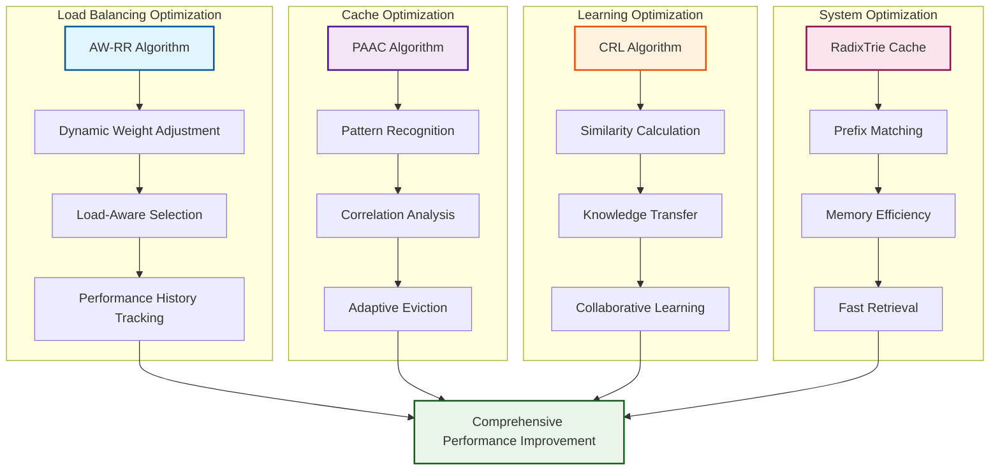
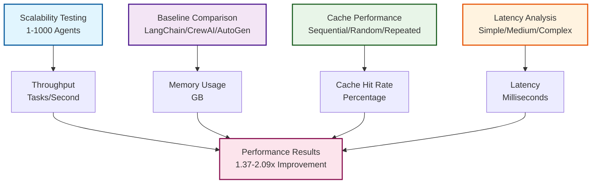
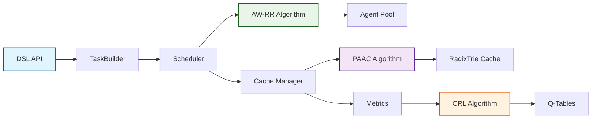

# Mermaid图表代码集合

## Figure 8. Multi-Agent DSL Framework Architecture



## Figure 9. AW-RR Algorithm Flow

```mermaid
flowchart TD
    A[New Task Arrives] --> B[Filter Capable Agents]
    B --> C[Calculate Load Factor]
    C --> D[Get Agent Weights]
    D --> E[Calculate Selection Score]
    E --> F[Select Best Agent]
    F --> G[Execute Task]
    G --> H[Calculate Performance]
    H --> I[Update Weights]
    I --> J[Normalize Weights]
    J --> A
    
    K[Load = Current/Max] -.-> C
    L[Score = Weight×(1-Load)] -.-> E
    M[Performance = Expected/Actual] -.-> H
    N[New Weight = 0.9×Old+0.1×Perf] -.-> I
    
    style A fill:#e3f2fd,stroke:#01579b,stroke-width:2px
    style F fill:#e8f5e8,stroke:#1b5e20,stroke-width:2px
    style I fill:#fff3e0,stroke:#e65100,stroke-width:2px
```

## Figure 10. PAAC Cache Algorithm Architecture


## Figure 11. CRL Collaborative Learning Mechanism



## Figure 12. Task Execution Flow



## Figure 13. Performance Optimization Strategy



## Figure 14. Experimental Evaluation Framework



## Figure 15. Framework Component Interaction



## 使用说明

### Python图表 (已生成)
以下图表已经用Python生成，保存在 `figures/` 目录中：

1. **throughput_comparison.png** - 吞吐量对比图
2. **scalability_analysis.png** - 可扩展性分析图
3. **cache_performance.png** - 缓存性能分析图
4. **latency_analysis.png** - 延迟分析图
5. **algorithm_comparison.png** - 算法性能对比图
6. **memory_usage.png** - 内存使用分析图
7. **performance_summary.png** - 性能总结雷达图

### Mermaid图表 (需要复制代码)
以下图表需要用Mermaid制作，请复制上面的代码到Mermaid编辑器：

1. **系统架构图** - 展示框架整体架构
2. **AW-RR算法流程图** - 展示负载均衡算法流程
3. **PAAC缓存算法架构** - 展示缓存算法架构
4. **CRL协作学习机制** - 展示协作学习机制
5. **任务执行流程图** - 展示任务执行流程
6. **性能优化策略图** - 展示优化策略
7. **实验评估框架图** - 展示实验设计
8. **框架组件交互图** - 展示组件交互

### 图表使用建议

1. **Python图表**: 直接插入论文，分辨率300 DPI，适合性能数据展示
2. **Mermaid图表**: 用于展示算法流程和系统架构，适合概念性说明
3. **组合使用**: Python图表展示数据，Mermaid图表展示流程
4. **学术标准**: 所有图表都有清晰的标题、图例和标注

### 图表质量
- **分辨率**: 300 DPI以上
- **格式**: PNG和PDF两种格式
- **颜色**: 学术友好的配色方案
- **字体**: 清晰易读的字体
- **标注**: 重要数据点标注
- **一致性**: 保持图表风格一致
